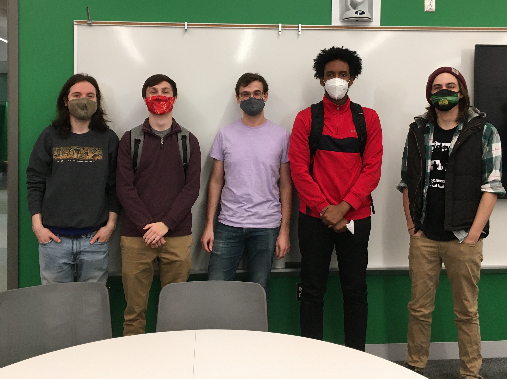

## About us

*From left to right: Tim Lilly, Jacob Lewis, Michael Reed, Ahmed Mohamed, and Richard Roberts.*

Jacob Lewis is a Senior in Computer Science at George Mason University. Outside
of programming, he is interested in baseball, fighting games, and chess.

Michael Reed is pursuing a Masters in Computer Science at George Mason University. When Michael isn't Cannon Bowling you can find them reading sci-fi novels, playing with friends on [Lichess](lichess.org), and going for walks.

TODO: Richard, Tim, Ahmed