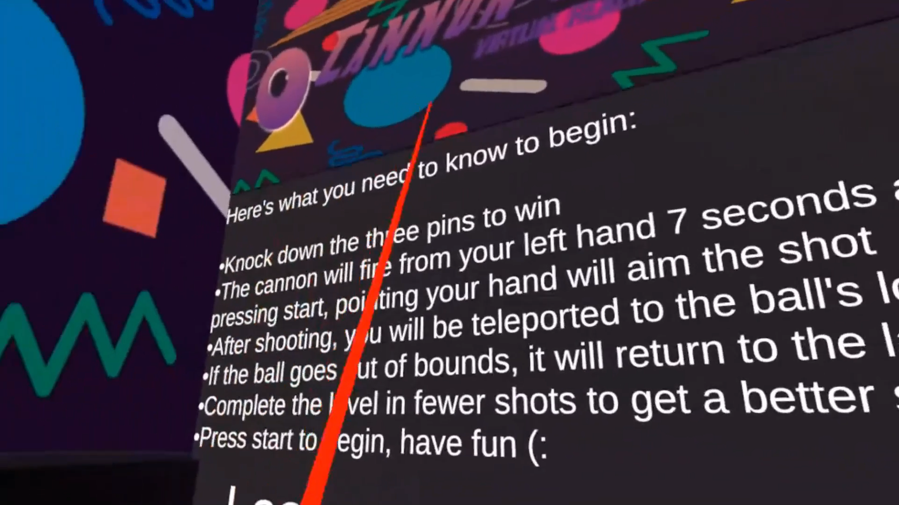
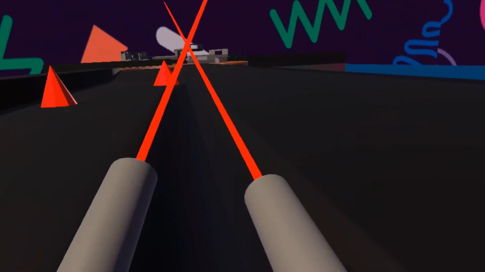
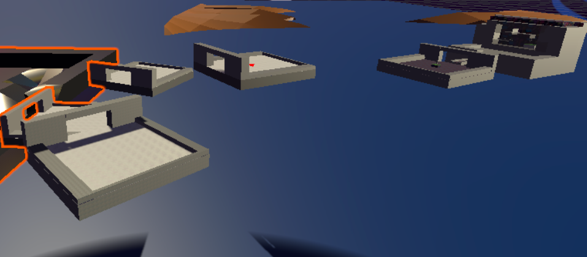
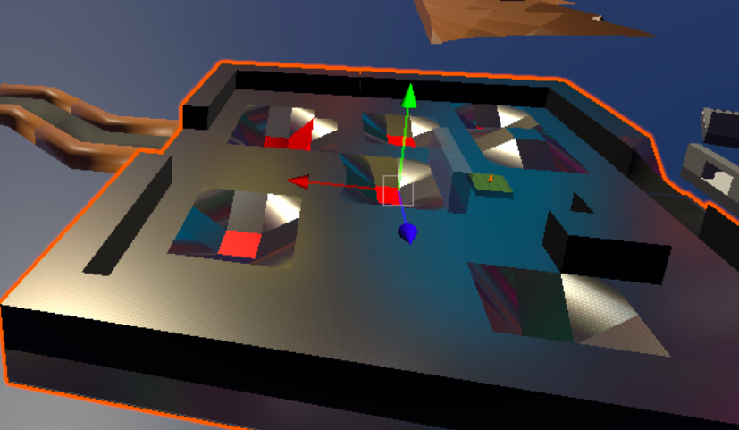
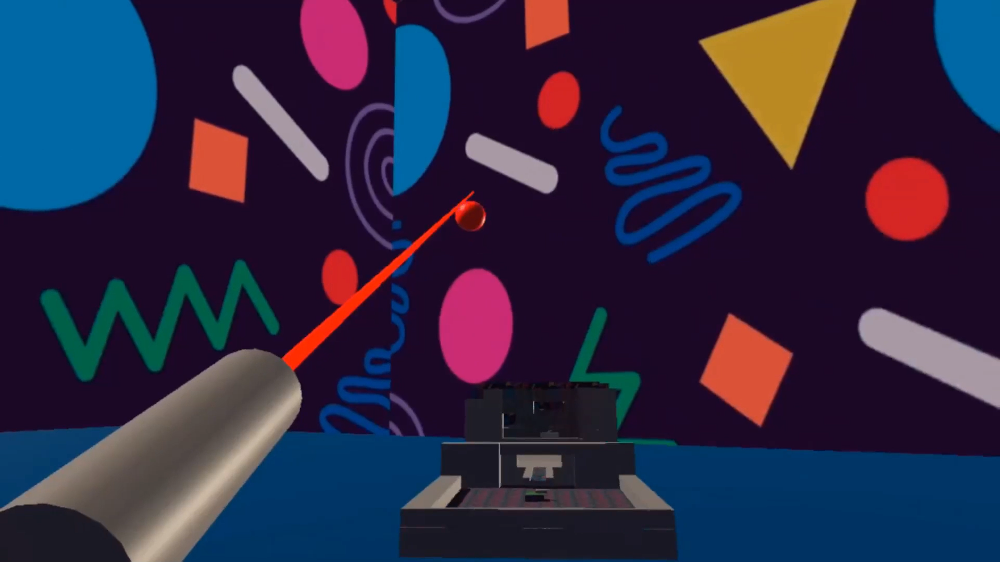

<figure>
    
    <figcaption>The rules of the game are printed at the start of the level in case the player needs to refresh their memory.</figcaption>
</figure>

<figure>
    
    <figcaption>The player's cannon arms have built-in laser pointers, making it easier to aim and, hopefully, get a hole-in-one.</figcaption>
</figure>

<figure>
    
    <figcaption>Our colorful skybox, inspired by 90s arcades.</figcaption>
</figure>

<figure>
    
    <figcaption>When shooting your cannonball between islands, it's easy to miss and have your ball fall into the abyss below.</figcaption>
</figure>

<figure>
    
    <figcaption>If the player shoots their cannonball into one of these ditches, then they're going to have a hard time getting out.</figcaption>
</figure>

<figure>
    
    <figcaption>A player fires their cannonball towards the final section of the course.</figcaption>
</figure>