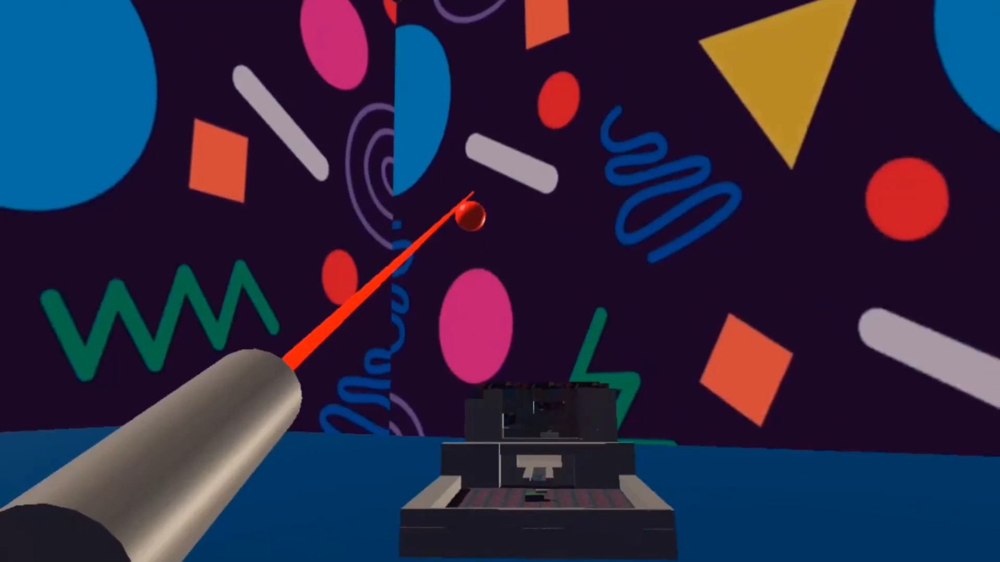

# Cannon-Bowling VR

We made the game *Cannon Bowling VR* (*CBVR*), which is like mini-golf but with
the golf club replaced by an arm-mounted cannon and the hole replaced by three
pins, like in bowling.  The goal of CBVR is to knock over the three pins in the
least number of cannonball firings.

Unlike in real-life mini-golf, where courses are small, relatively flat, and
mostly free of obstacles, CBVR's course is massive and dense with obstacles.
The course spans hundreds of meters in all directions, making for a more epic
golfing experience.  Our course also has multiple floating islands, which must
be traversed in turn to get to the pins.  Be careful when island hopping---its
easy to misfire a cannonball that rolls off an island into the abyss!

## Demo

<!-- Embed the demo from vimeo -->

<iframe src="https://player.vimeo.com/video/652309900?h=6100699833" style="position:absolute;top:0;left:0;width:100%;height:100%;" frameborder="0" allow="autoplay; fullscreen; picture-in-picture" allowfullscreen></iframe>

## Gallery

- 
- 
- 
- 
- 
- 
- 

## About us

*From left to right: Tim Lilly, Jacob Lewis, Michael Reed, Ahmed Mohamed, and Richard Roberts.*

Jacob Lewis is a Senior in Computer Science at George Mason University. Outside
of programming, he is interested in baseball, fighting games, and chess.

Michael Reed is pursuing a Masters in Computer Science at George Mason University. When Michael isn't Cannon Bowling you can find them reading sci-fi novels, playing with friends on [Lichess](lichess.org), and going for walks.

TODO: Richard, Tim, Ahmed